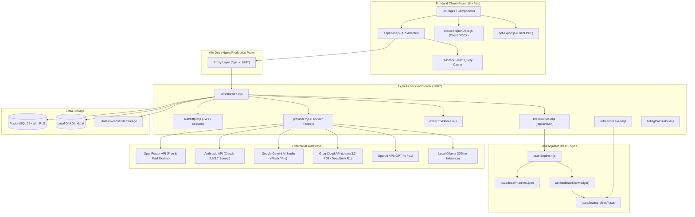
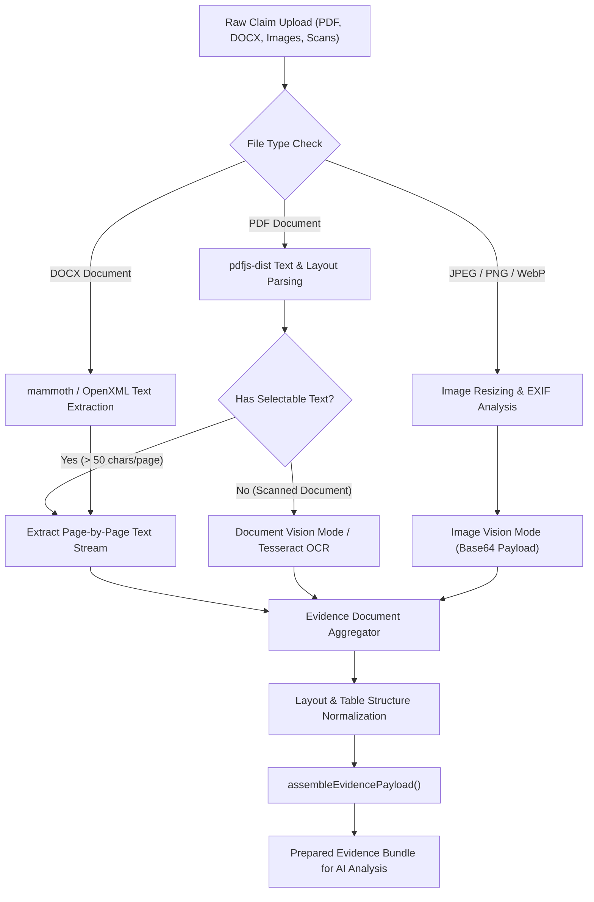
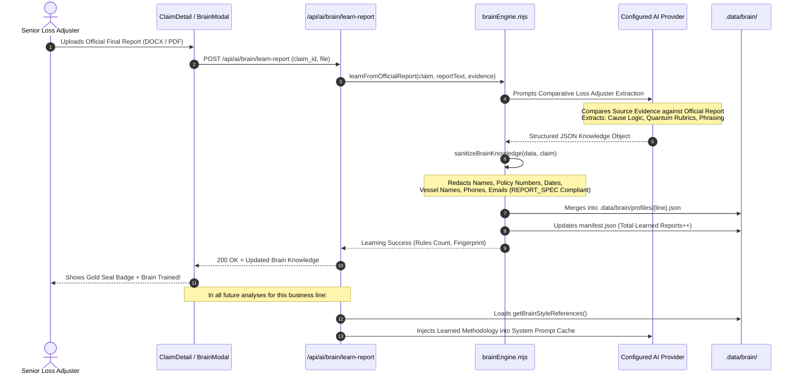
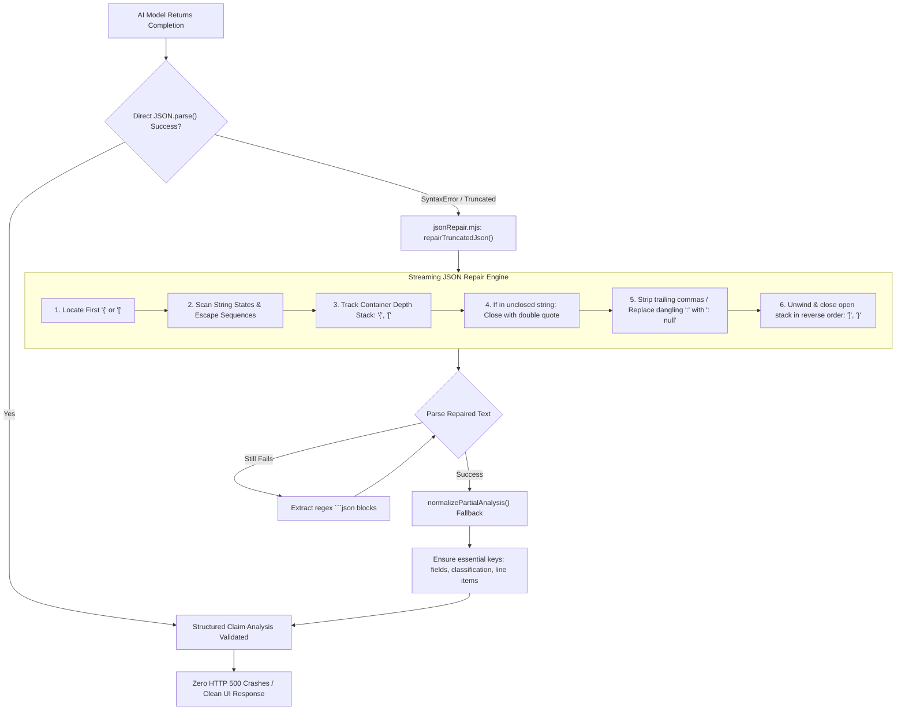
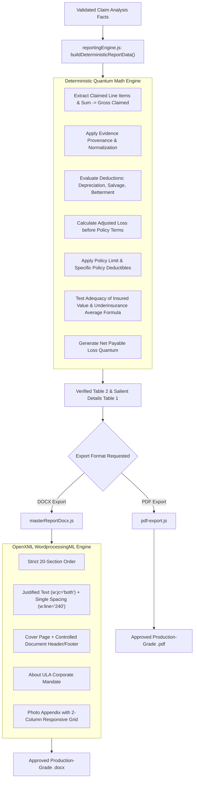
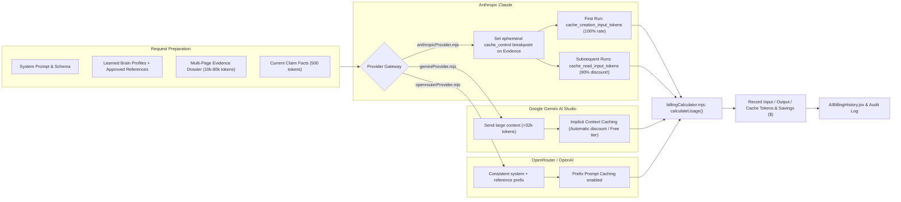
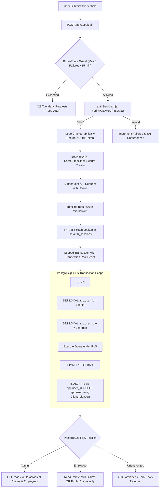

# ULA Claims Hub — System Architecture, Specification & Reference Manual

> **System Name**: United Loss Adjusters (ULA) AI Claims Hub & Autonomous Adjuster Brain  
> **Classification**: Production Loss Adjusting Platform & Cognitive Engine  
> **Mandatory Standard**: Strict compliance with [`docs/REPORT_SPEC.md`](file:///c:/Users/AMR0/Documents/git/ULA/docs/REPORT_SPEC.md)  
> **Last Updated**: September 2026  

---

## Table of Contents

1. [System Overview & Operating Principles](#1-system-overview--operating-principles)
2. [End-to-End System Diagrams (Mermaid)](#2-end-to-end-system-diagrams-mermaid)
   - [2.1 High-Level Infrastructure Topology](#21-high-level-infrastructure-topology)
   - [2.2 Multi-Modal Evidence Ingestion Pipeline](#22-multi-modal-evidence-ingestion-pipeline)
   - [2.3 Autonomous Loss Adjuster Brain Learning Loop](#23-autonomous-loss-adjuster-brain-learning-loop)
   - [2.4 Zero-Failure Generation & JSON Repair Subsystem](#24-zero-failure-generation--json-repair-subsystem)
   - [2.5 Master Report Deterministic Calculation & Export Flow](#25-master-report-deterministic-calculation--export-flow)
   - [2.6 Prompt Caching & AI Billing Architecture](#26-prompt-caching--ai-billing-architecture)
   - [2.7 Authentication, Authorization & Row-Level Security](#27-authentication-authorization--row-level-security)
3. [Database & Persistence Schemas](#3-database--persistence-schemas)
   - [3.1 PostgreSQL Production Schema & RLS](#31-postgresql-production-schema--rls)
   - [3.2 DiskDb Local Development Schema](#32-diskdb-local-development-schema)
   - [3.3 Audit Logging & State Transitions](#33-audit-logging--state-transitions)
4. [AI Claim Analysis & Brain Schemas](#4-ai-claim-analysis--brain-schemas)
   - [4.1 Claim Analysis Zod Schema (`claimAnalysisSchema.mjs`)](#41-claim-analysis-zod-schema-claimanalysisschemamjs)
   - [4.2 Loss Adjuster Brain Manifest & Profile Schemas](#42-loss-adjuster-brain-manifest--profile-schemas)
   - [4.3 Approved Style Reference Schemas](#43-approved-style-reference-schemas)
5. [The Autonomous Loss Adjuster Brain Engine](#5-the-autonomous-loss-adjuster-brain-engine)
   - [5.1 Official Final Report Ingestion Workflow](#51-official-final-report-ingestion-workflow)
   - [5.2 Comparative Learning Prompt & Methodology Distillation](#52-comparative-learning-prompt--methodology-distillation)
   - [5.3 Strict Entity Sanitization & Non-Leakage Compliance](#53-strict-entity-sanitization--non-leakage-compliance)
   - [5.4 Reference Layer Re-Injection](#54-reference-layer-re-injection)
6. [Zero-Failure Generation & Resilience Subsystem](#6-zero-failure-generation--resilience-subsystem)
   - [6.1 Streaming JSON Repair Engine (`jsonRepair.mjs`)](#61-streaming-json-repair-engine-jsonrepairmjs)
   - [6.2 Partial Analysis Normalization Fallback](#62-partial-analysis-normalization-fallback)
   - [6.3 Token Cap Expansion (16,384+ Tokens)](#63-token-cap-expansion-16384-tokens)
7. [AI Provider Architecture & Model Catalog](#7-ai-provider-architecture--model-catalog)
   - [7.1 Provider Abstraction Interface](#71-provider-abstraction-interface)
   - [7.2 Supported Model Catalog (Free & Paid Tiers)](#72-supported-model-catalog-free--paid-tiers)
   - [7.3 Prompt Caching Mechanics & Cost Calculator](#73-prompt-caching-mechanics--cost-calculator)
8. [Master Report Engine & DOCX/PDF Generation](#8-master-report-engine--docxpdf-generation)
   - [8.1 Mandatory 20-Section Report Order](#81-mandatory-20-section-report-order)
   - [8.2 The Five Director Requirements](#82-the-five-director-requirements)
   - [8.3 Deterministic Quantum Calculation Rules](#83-deterministic-quantum-calculation-rules)
   - [8.4 DOCX Paragraph Formatting & OpenXML Generation](#84-docx-paragraph-formatting--openxml-generation)
   - [8.5 Photo Appendix Extraction & Layout](#85-photo-appendix-extraction--layout)
9. [REST API Specification](#9-rest-api-specification)
10. [Frontend Architecture & UI Components](#10-frontend-architecture--ui-components)
11. [Configuration & Environment Reference (`.env`)](#11-configuration--environment-reference-env)
12. [Repository Directory Map & Key File Links](#12-repository-directory-map--key-file-links)

---

## 1. System Overview & Operating Principles

The **ULA AI Claims Hub** is an enterprise loss adjusting platform built for **United Loss Adjusters (ULA)**. It accelerates the end-to-end adjustment of complex commercial claims (Marine Cargo, Property & Fire, Bulk Vessel, Air Shipment, Land Shipment, Yacht, and Fidelity) through multi-modal document understanding, autonomous methodology distillation, and strict deterministic report generation.

### Fundamental Operating Principles

1. **Non-Negotiable Spec Adherence ([`docs/REPORT_SPEC.md`](file:///c:/Users/AMR0/Documents/git/ULA/docs/REPORT_SPEC.md))**:
   All report calculations, section ordering, formatting, evidence citations, and phrasing standards are strictly governed by `REPORT_SPEC.md`. No AI provider or runtime module may alter approved structures without explicit Director authorization.
2. **Zero Claim Data Leakage**:
   Historical reports and learned profiles act **strictly as style and methodology references**. They define proximate cause logic, reasoning trees, and quantum rubrics, but **never supply or influence claim-specific entities** (parties, dates, policy numbers, vessel names, currency amounts, or invoice values) across files.
3. **Deterministic Quantum Calculations**:
   The AI analyzes facts, extracts invoice line items, and detects policy provisions, but all mathematical adjustments (claimed amounts, depreciation rates, deductibles, salvage reductions, underinsurance averages) are executed via **deterministic arithmetic code** in [`reportingEngine.js`](file:///c:/Users/AMR0/Documents/git/ULA/src/lib/reportingEngine.js). The system never accepts free-form hallucinated math.
4. **Zero-Failure Fault Tolerance**:
   Token cutoffs, partial JSON responses, and HTTP 500 crashes are eliminated via the streaming JSON repair algorithm ([`jsonRepair.mjs`](file:///c:/Users/AMR0/Documents/git/ULA/server/ai/jsonRepair.mjs)), provider failovers, and partial analysis normalization.
5. **Prompt Caching & Economic Efficiency**:
   Long evidence dossiers and style reference profiles are cached at the provider layer (Anthropic ephemeral breakpoints, Gemini implicit caching, OpenRouter prefix caching), cutting API latency by up to 80% and input token costs by up to 90%.

---

## 2. End-to-End System Diagrams (Mermaid)

### 2.1 High-Level Infrastructure Topology



---

### 2.2 Multi-Modal Evidence Ingestion Pipeline



---

### 2.3 Autonomous Loss Adjuster Brain Learning Loop



---

### 2.4 Zero-Failure Generation & JSON Repair Subsystem



---

### 2.5 Master Report Deterministic Calculation & Export Flow



---

### 2.6 Prompt Caching & AI Billing Architecture



---

### 2.7 Authentication, Authorization & Row-Level Security



---

## 3. Database & Persistence Schemas

The ULA Claims Hub supports dual persistence layers:
1. **Production Mode (`VITE_SQL_BACKEND=true`)**: Hardened PostgreSQL 15+ with strict Row-Level Security (RLS) enforcement.
2. **Local Development Mode**: Lightweight, zero-configuration file store in `.data/` via [`diskDb.mjs`](file:///c:/Users/AMR0/Documents/git/ULA/server/db/diskDb.mjs).

### 3.1 PostgreSQL Production Schema & RLS

All tables exist in the dedicated `ula` schema.

```sql
-- Schema Creation & Identity Accessors
create schema if not exists ula;

create or replace function ula.current_actor_id() returns text
language sql stable as $$ select nullif(current_setting('app.user_id', true), '') $$;

create or replace function ula.current_actor_is_admin() returns boolean
language sql stable as $$ select current_setting('app.user_role', true) = 'admin' $$;

-- 1. Employees Table
create table if not exists ula.employees (
  id text primary key,
  user_id text not null unique,
  data jsonb not null default '{}'::jsonb,
  created_at timestamptz not null default now(),
  updated_at timestamptz not null default now()
);

-- 2. Claims Table
create table if not exists ula.claims (
  id text primary key,
  owner_id text not null,
  visibility text not null check (visibility in ('private', 'public')),
  data jsonb not null default '{}'::jsonb,
  created_at timestamptz not null default now(),
  updated_at timestamptz not null default now()
);

-- 3. Claim Documents Table
create table if not exists ula.claim_documents (
  id text primary key,
  claim_id text not null references ula.claims(id) on delete cascade,
  data jsonb not null default '{}'::jsonb,
  created_at timestamptz not null default now(),
  updated_at timestamptz not null default now()
);

-- 4. Report Versions Table
create table if not exists ula.report_versions (
  id text primary key,
  claim_id text not null references ula.claims(id) on delete cascade,
  data jsonb not null default '{}'::jsonb,
  created_at timestamptz not null default now(),
  updated_at timestamptz not null default now()
);

-- 5. Leave Requests Table
create table if not exists ula.leave_requests (
  id text primary key,
  employee_id text not null references ula.employees(id) on delete restrict,
  user_id text not null,
  data jsonb not null default '{}'::jsonb,
  created_at timestamptz not null default now(),
  updated_at timestamptz not null default now()
);

-- 6. Audit Log Table
create table if not exists ula.audit_log (
  id uuid primary key default gen_random_uuid(),
  actor_id text not null,
  actor_role text not null,
  action text not null,
  entity text not null,
  record_id text,
  record_label text,
  before_value jsonb,
  after_value jsonb,
  occurred_at timestamptz not null default now()
);
```

#### Row-Level Security (RLS) Policy Matrix

| Table | Operation | Policy Logic |
|---|---|---|
| `ula.employees` | `SELECT` | `current_actor_is_admin() OR user_id = current_actor_id()` |
| `ula.employees` | `INSERT/UPDATE/DELETE` | `current_actor_is_admin()` only |
| `ula.claims` | `SELECT` | `current_actor_is_admin() OR owner_id = current_actor_id() OR visibility = 'public'` |
| `ula.claims` | `INSERT` | `owner_id = current_actor_id()` |
| `ula.claims` | `UPDATE/DELETE` | `current_actor_is_admin() OR owner_id = current_actor_id()` |
| `ula.claim_documents` | `SELECT` | Cascades through parent claim accessibility |
| `ula.claim_documents` | `INSERT/UPDATE/DELETE`| `current_actor_is_admin() OR parent_claim.owner_id = current_actor_id()` |
| `ula.report_versions` | `ALL` | Inherits parent claim ownership & admin rules |
| `ula.leave_requests` | `SELECT` | `current_actor_is_admin() OR user_id = current_actor_id()` |
| `ula.audit_log` | `SELECT` | `current_actor_is_admin()` only (append-only) |

---

### 3.2 DiskDb Local Development Schema

In development mode, entities are serialized to `.data/claims_db.json` and `.data/auth_db.json`.

#### Supported Entity Types ([`ENTITY_NAMES`](file:///c:/Users/AMR0/Documents/git/ULA/server/db/diskDb.mjs#L14-L22))
1. `Claim`
2. `ClaimDocument`
3. `Employee`
4. `Leave`
5. `ReportVersion`
6. `AuditLog`
7. `User`

#### Claim Document JSON Shape
```json
{
  "id": "doc-uuid",
  "claim_id": "claim-uuid",
  "name": "Bill_of_Lading.pdf",
  "category": "Official Final Report | Policy | Commercial Invoice | Survey Report",
  "file_type": "application/pdf",
  "size_bytes": 1048576,
  "storage_path": "uploads/1725600000_Bill_of_Lading.pdf",
  "uploaded_at": "2026-09-06T12:00:00Z",
  "uploaded_by": "user-uuid",
  "extracted_text": "...",
  "page_count": 4,
  "status": "processed"
}
```

#### Report Version JSON Shape
```json
{
  "id": "rep-version-uuid",
  "claim_id": "claim-uuid",
  "version_number": "1.0",
  "issue_state": "Draft | Final",
  "status": "Draft | In Review | Approved | Final",
  "is_official_upload": true,
  "source_file_name": "Official_Final_Report.docx",
  "storage_key": "uploads/1725600000_Official_Final_Report.docx",
  "brain_learning_status": "learned | pending | failed",
  "brain_learned_at": "2026-09-06T12:30:00Z",
  "summary": "...",
  "adjusted_amount": 142500.00,
  "currency": "USD",
  "created_at": "2026-09-06T12:00:00Z"
}
```

---

## 4. AI Claim Analysis & Brain Schemas

### 4.1 Claim Analysis Zod Schema ([`claimAnalysisSchema.mjs`](file:///c:/Users/AMR0/Documents/git/ULA/server/ai/claimAnalysisSchema.mjs))

The analysis schema enforces typed loss adjusting facts extracted from raw evidence files:

#### Business Lines ([`BUSINESS_LINES`](file:///c:/Users/AMR0/Documents/git/ULA/server/ai/claimAnalysisSchema.mjs#L3-L13))
- `"Yacht"`
- `"Property"`
- `"Marine Cargo (Reefer/GFS)"`
- `"Marine Cargo (Non-Reefer)"`
- `"Bulk Vessel"`
- `"Air Shipment (NET)"`
- `"Land Shipment"`
- `"Fidelity Claims"`
- `"Other / Requires Review"`

#### Key Schemas
```typescript
interface SourceCitation {
  document_id: string;
  document_name: string;
  page: number | null;
  supporting_text: string;
  confidence: number; // 0.0 - 1.0
  evidence_mode: "extracted_text" | "document_vision" | "image_vision";
}

interface ClaimField {
  field: string; // 113 supported claim fields
  value: string | null;
  normalized_value: string | null;
  confidence: number;
  requires_confirmation: boolean;
  sources: SourceCitation[];
}

interface AdjustmentLineItem {
  description: string;
  quantity: string | null;
  unit_price: string | null;
  adjusted_value: string;
  currency: string | null;
  basis: string; // "invoice_rate" | "surveyor_assessment" | "depreciation"
  confidence: number;
  sources: SourceCitation[];
}

interface EvidenceFinding {
  analysis_domain: "chronology_custody" | "condition_extent" | "proximate_cause" | 
                   "policy_application" | "quantum_mitigation" | "liability_recovery" | "general";
  finding: string;
  confidence: number;
  sources: SourceCitation[];
}
```

---

### 4.2 Loss Adjuster Brain Manifest & Profile Schemas

Stored in `.data/brain/manifest.json` and `.data/brain/profiles/{business_line_key}.json`.

#### `manifest.json`
```json
{
  "version": 1,
  "created_at": "2026-09-06T10:00:00.000Z",
  "updated_at": "2026-09-06T12:00:00.000Z",
  "total_learned_reports": 14,
  "learned_reports": [
    {
      "claim_id": "claim-102",
      "claim_title": "Damaged Frozen Seafood Consignment",
      "business_line": "Marine Cargo (Reefer/GFS)",
      "file_name": "Official_Final_Report_v1.docx",
      "fingerprint": "a4f89d01e4bc8120",
      "learned_at": "2026-09-06T11:45:00.000Z",
      "rules_learned": 18
    }
  ],
  "business_lines": {
    "marine_cargo_reefer_gfs": 8,
    "property_fire": 4,
    "air_shipment_net": 2
  }
}
```

#### Line of Business Profile Schema (`.data/brain/profiles/marine_cargo_reefer_gfs.json`)
```json
{
  "business_line": "Marine Cargo (Reefer/GFS)",
  "profile_id": "brain_marine_cargo_reefer_gfs",
  "version": 2,
  "last_updated": "2026-09-06T12:00:00.000Z",
  "ingested_reports_count": 8,
  "cause_of_loss_rules": [
    {
      "rule_type": "mechanism_testing",
      "guidance": "Distinguish between continuous thermal abuse in transit versus pre-shipment latent deterioration through thermograph download analysis.",
      "example_phrasing": "Analysis of the Partlow temperature recording disc confirms operating temperatures remained within setpoint tolerances during oceanic transit; deviations occurred exclusively post-discharge."
    }
  ],
  "quantum_adjustment_rubrics": [
    {
      "category": "salvage",
      "decision_rule": "Apply distressed commercial salvage allowance only upon proof of certified secondary wholesale disposal.",
      "arithmetic_logic": "Salvage deduction = Gross Invoiced Cost less net realized salvage proceeds after deducting documented haulage and re-packaging expenses."
    }
  ],
  "policy_application_principles": [
    {
      "provision_type": "warranty",
      "interpretation_standard": "Reefer machinery warranty requires evidence of pre-trip inspection (PTI) within 48 hours prior to stuffing."
    }
  ],
  "adjuster_phrasing_and_tone": [
    {
      "section": "conclusion",
      "pattern": "Maintain objective third-party detachment; state findings as supported by contemporaneous records rather than personal conjecture."
    }
  ],
  "distinctive_best_practices": [
    "Always cite the container serial number and seal integrity record before discussing physical cargo state."
  ]
}
```

---

## 5. The Autonomous Loss Adjuster Brain Engine

### 5.1 Official Final Report Ingestion Workflow

When an adjuster uploads an approved official report (DOCX or PDF), the system:
1. Stores the document in the persistent storage folder.
2. Creates or flags a `ReportVersion` with `is_official_upload: true` and `issue_state: "Final"`.
3. Displays a prominent **Official Final Report** badge with gold seal accents in the claim interface.
4. Triggers the learning workflow via [`POST /api/ai/brain/learn-report`](file:///c:/Users/AMR0/Documents/git/ULA/server/ai/brain/brainRoutes.mjs).

---

### 5.2 Comparative Learning Prompt & Methodology Distillation

The Brain Engine ([`brainEngine.mjs`](file:///c:/Users/AMR0/Documents/git/ULA/server/ai/brain/brainEngine.mjs)) constructs a dual-corpus comparative prompt:
- **Corpus A**: The official approved final report written by the senior loss adjuster.
- **Corpus B**: The raw evidence files (invoices, surveys, temperature charts, bills of lading).

The AI is tasked with answering:
> *"How did the master adjuster bridge the raw evidence to their final conclusions, causation verdict, and monetary adjustments?"*

---

### 5.3 Strict Entity Sanitization & Non-Leakage Compliance

Under `docs/REPORT_SPEC.md`, historical reports **must never leak specific claim facts** (parties, dates, policy numbers, vessel names, currency amounts) across files.

To guarantee zero leakage, [`sanitizeBrainKnowledge`](file:///c:/Users/AMR0/Documents/git/ULA/server/ai/brain/brainEngine.mjs#L51-L90) recursively strips:
- Insured, applicant, broker, insurer, surveyor, and carrier names -> `[REDACTED_CLAIM_ENTITY]`
- Specific policy numbers, claim numbers, voyage numbers -> `[REDACTED_CLAIM_ENTITY]`
- Vessel names and conveyance references -> `[REDACTED_CLAIM_ENTITY]`
- Telephone numbers -> `[PHONE]`
- Email addresses -> `[EMAIL]`

---

### 5.4 Reference Layer Re-Injection

In [`referenceLayer.mjs`](file:///c:/Users/AMR0/Documents/git/ULA/server/ai/referenceLayer.mjs), `loadApprovedStyleReferences()` dynamically invokes `getBrainStyleReferences()`.
When any adjuster subsequently analyzes a claim:
1. The system loads the approved base reference profile (e.g. `gfs-reefer-approved.json`).
2. Appends the accumulated Loss Adjuster Brain wisdom for that line of business.
3. Packages both into the system prompt cached prefix.

---

## 6. Zero-Failure Generation & Resilience Subsystem

### 6.1 Streaming JSON Repair Engine ([`jsonRepair.mjs`](file:///c:/Users/AMR0/Documents/git/ULA/server/ai/jsonRepair.mjs))

Dense claim reports frequently push models to maximum token limits, cutting off output mid-JSON. Standard parsers throw fatal exceptions, resulting in HTTP 500 crashes.

The `repairTruncatedJson` algorithm solves this deterministically:
1. **Locate Start**: Finds the first `{` or `[`.
2. **Scanner Tracking**: Iterates character-by-character tracking:
   - String quotation boundary states (`"`)
   - Escape sequences (`\"`, `\\`)
   - Container depth stack (`{` pushes `{`, `}` pops `{`; `[` pushes `[`, `]` pops `[`).
3. **Unclosed String Resolution**: If truncated inside a string literal, appends a closing `"` (stripping trailing invalid escapes).
4. **Dangling Separator Pruning**: Strips trailing commas (`,`) and fixes dangling colons (`:` -> `: null`).
5. **Reverse Unwinding**: Pops the remaining container stack in reverse, appending the matching `}` or `]`.

```javascript
// Example of repaired payload:
// Raw cut-off:   {"findings": [{"domain": "proximate_cause", "finding": "The cargo suffered freez
// Repaired output: {"findings": [{"domain": "proximate_cause", "finding": "The cargo suffered freez"}]}
```

---

### 6.2 Partial Analysis Normalization Fallback

If a model payload is missing top-level keys or was severely truncated, [`openrouterProvider.mjs`](file:///c:/Users/AMR0/Documents/git/ULA/server/ai/providers/openrouterProvider.mjs) passes the object through `normalizePartialAnalysis`:
- Defaults missing `fields` to `[]`.
- Defaults missing `adjustment_line_items` to `[]`.
- Defaults missing `evidence_findings` to `[]`.
- Sets `classification.business_line` to `"Other / Requires Review"` if absent.
- Preserves all validly parsed facts instead of crashing the analysis run.

---

### 6.3 Token Cap Expansion (16,384+ Tokens)

- OpenRouter default max completion tokens increased from `2,500` to **`16,384`**.
- Gemini AI Studio configured with `max_completion_tokens: 16384`.
- Anthropic Claude configured with `max_tokens: 16384`.
- OpenAI configured with `max_tokens: 16384`.

---

## 7. AI Provider Architecture & Model Catalog

### 7.1 Provider Abstraction Interface ([`provider.mjs`](file:///c:/Users/AMR0/Documents/git/ULA/server/ai/provider.mjs))

All AI integrations implement a unified asynchronous interface:
```typescript
interface AIProvider {
  analyze(options: {
    claim: object;
    evidence: EvidenceDocument[];
    files: object[];
    styleReferences: StyleReference[];
  }): Promise<{
    type: "ai_analysis_completed";
    provider: string;
    model: string;
    analysis: ClaimAnalysis;
    usage: TokenUsage;
    raw_completion?: string;
  }>;
}
```

---

### 7.2 Supported Model Catalog (Free & Paid Tiers)

Updated in [`AIModelSelector.jsx`](file:///c:/Users/AMR0/Documents/git/ULA/src/components/AIModelSelector.jsx):

| Provider | Model Identifier | Tier | Best Use Case |
|---|---|---|---|
| **OpenRouter** | `meta-llama/llama-3.3-70b-instruct:free` | **FREE** | General claim analysis & document extraction |
| **OpenRouter** | `deepseek/deepseek-r1:free` | **FREE** | Complex causation & forensic reasoning |
| **OpenRouter** | `deepseek/deepseek-chat:free` | **FREE** | Fast structured JSON extraction |
| **OpenRouter** | `google/gemini-2.0-flash-exp:free` | **FREE** | High-speed multi-modal document vision |
| **Google** | `gemini-2.0-flash` | **Free Tier** | High-volume claims, implicit prompt caching |
| **Google** | `gemini-1.5-pro` | Free / Paid | Massive 1M+ token evidence archives |
| **Groq** | `groq:llama-3.3-70b-versatile` | Free / Fast | Sub-second inference latency |
| **Groq** | `groq:deepseek-r1-distill-llama-70b` | Free / Fast | High-speed logical deduction |
| **Anthropic** | `claude-3-7-sonnet` | Paid Tier | Gold-standard loss adjuster reports |
| **Anthropic** | `claude-3-5-haiku` | Paid Tier | Ultra-low-cost preliminary triage |
| **OpenAI** | `gpt-4o` | Paid Tier | Native image & PDF vision analysis |
| **OpenAI** | `gpt-4o-mini` | Paid Tier | High-throughput structured drafting |
| **Ollama** | `ollama:llama3` | Self-Hosted | Air-gapped, zero external data transit |
| **Free Demo** | `mock-pipeline` | Offline | Instant testing with zero API costs |

---

### 7.3 Prompt Caching Mechanics & Cost Calculator ([`billingCalculator.mjs`](file:///c:/Users/AMR0/Documents/git/ULA/server/ai/billingCalculator.mjs))

Calculates real-time token economics:
- **Anthropic Claude**:
  - Ephemeral cache read discount: **90% off input tokens** ($0.30/1M vs $3.00/1M).
- **Google Gemini**:
  - Implicit caching: Automatically applies discounts when evidence prefixes exceed 32k tokens.
- **OpenRouter**:
  - Prefix caching tracks cache hits and calculates estimated dollar savings per run.

---

## 8. Master Report Engine & DOCX/PDF Generation

### 8.1 Mandatory 20-Section Report Order

Per [`docs/REPORT_SPEC.md`](file:///c:/Users/AMR0/Documents/git/ULA/docs/REPORT_SPEC.md#L29-L59), reports are generated strictly in this sequence:

1. **Cover Page**
2. **Document Control Page**
3. **Version History**
4. **Report Summary**
5. **Report and adjustment note**
6. **Table 1 - Summary and salient details**
7. **INTEREST INSURED & RELEVANT CONDITIONS OF INSURANCE POLICY**
8. **SHIPMENT ROUTING** *(Inserted only for shipment business lines)*
9. **SURVEYOR NOTES**
10. **CAUSE OF LOSS**
11. **RELEVANT POLICY WARRANTIES & CONDITIONS**
12. **ADEQUACY OF THE INSURED VALUE**
13. **APPOINTMENT OF ASSESSORS**
14. **CLAIM PRESENTED ON THE POLICY & ADJUSTMENT**
15. **Table 2 - Claim presented by the Assured & Adjustment**
16. **CONCLUSION**
17. **Enclosure to this report** *(Title-only section)*
18. **Outstanding Documents** *(Title-only section)*
19. **Appendix A - Photographs** *(Responsive 2-column image layout)*
20. **About ULA / controlled corporate material**

---

### 8.2 The Five Director Requirements

1. **Report Summary**:
   - Preserves current-claim Introduction verbatim or generates concise appointment scope.
   - Follows with `"In brief, Table 1 records..."` and the salient details table.
   - Concludes under `"In our opinion"` with the five standard conclusion bullets.
2. **Cause of Loss**:
   - Begins with approved proximate-cause lead forms.
   - Distinguishes physical damage evidence from professional opinion.
3. **Adequacy of Insured Value**:
   - Strictly tests comparable evidenced values. Never states adequacy or underinsurance without arithmetic justification.
4. **Appointment of Assessors**:
   - Must contain exactly this statutory sentence:
   > *"To date, it is understood that the Assured had not appointed a loss assessor to act on their behalf."*
5. **Table 2 & Adjustment Schedule**:
   - Claims presented vs adjusted breakdown. Reconciles invoice unit costs, deductions, and deductibles deterministically.

---

### 8.3 Deterministic Quantum Calculation Rules

Executed by [`reportingEngine.js`](file:///c:/Users/AMR0/Documents/git/ULA/src/lib/reportingEngine.js):

$$\text{Gross Evidenced Loss} = \sum (\text{Damaged Quantity} \times \text{Invoice Unit Rate})$$

$$\text{Net Adjusted Loss} = \text{Gross Loss} - \text{Depreciation} - \text{Salvage} - \text{Deductions}$$

$$\text{Underinsurance Factor} = \min\left(1.0, \frac{\text{Sum Insured}}{\text{Evidenced CIF Value} \times (1 + \text{Valuation Uplift})}\right)$$

$$\text{Adjusted Claim Payable} = \max(0, (\text{Net Adjusted Loss} \times \text{Underinsurance Factor}) - \text{Policy Deductible})$$

---

### 8.4 DOCX Paragraph Formatting & OpenXML Generation

Implemented in [`masterReportDocx.js`](file:///c:/Users/AMR0/Documents/git/ULA/src/lib/masterReportDocx.js):
- **Paragraph Alignment**: Justified text across all narrative sections (`w:jc w:val="both"`).
- **Line Spacing**: Single line spacing (`w:spacing w:line="240" w:lineRule="auto"`).
- **Typography**: Corporate font family (Barlow Condensed for headings, Source Sans 3 for body).
- **Page Setup**: Standard A4 with controlled margins and running headers/footers.

---

## 9. REST API Specification

### Authentication Endpoints
- `POST /api/auth/login`: Authenticates user credentials using `scrypt`; issues an `HttpOnly; SameSite=Strict; Secure` session cookie containing an opaque 256-bit token. Built-in brute-force protection locks out after 5 failed attempts per 15 minutes (`429 Too Many Requests` with `Retry-After`).
- `POST /api/auth/register`: Submits a new user registration for admin review.
- `POST /api/auth/logout`: Invalidates the session and deletes token hash from `ula.auth_sessions`.
- `POST /api/auth/request-password-reset`: Initiates password reset flow with 30-minute single-use token.
- `POST /api/auth/reset-password`: Sets new password and purges existing active sessions.

### Entity Management Endpoints
- `GET /api/entities/:entity`: Lists records under Row-Level Security (RLS) scoping per authenticated user.
- `GET /api/entities/:entity/:id`: Retrieves single entity by ID under RLS.
- `POST /api/entities/:entity`: Creates a new record with audit logging.
- `PUT /api/entities/:entity/:id`: Updates an existing record under RLS with audit tracking.
- `DELETE /api/entities/:entity/:id`: Deletes record under RLS with audit logging.

### AI & Brain Endpoints
- `POST /api/ai/analyze`: Runs full multi-modal AI claim analysis across uploaded evidence. Rate-limited to 30 requests/minute per client IP to prevent cost exhaustion.
- `GET /api/ai/status`: Reports active provider configuration, model availability, and connectivity.
- `POST /api/ai/preflight`: Validates Anthropic payload token bounds and credentials locally before dispatch.
- `GET /api/ai/brain/status`: Returns Loss Adjuster Brain metrics (total learned reports, business line counts, prompt caching status).
- `GET /api/ai/brain/profiles`: Returns distilled reasoning playbooks and rubrics.
- `POST /api/ai/brain/learn-report`: Ingests an official final report, extracts methodology, sanitizes entities, and merges knowledge into profiles.
- `DELETE /api/ai/brain/profiles/:businessLine`: Purges learned rules and resets the profile for a specific business line.
- `DELETE /api/ai/brain/profiles/:businessLine/rules`: Deletes an individual rule from a profile by category and index.

### Document Physical Storage Endpoints
- `POST /api/documents/upload`: File upload handler with strict extension allowlist validation (`.pdf`, `.docx`, `.xlsx`, `.csv`, images, text) and blocking of executable/script extensions.
- `GET /api/documents/file/:filename`: Streams document with directory traversal check (`path.resolve` containment) and Row-Level Security verification (queries both `ula.claim_documents` and `ula.report_versions`).
- `GET /api/documents/:key`: Retrieves document metadata with RLS access verification.
- `DELETE /api/documents/:key`: Deletes document file after verifying caller is an administrator or the claim owner.

---

## 10. Frontend Architecture & UI Components

The frontend is a modern Single Page Application (SPA) built with React 18, Vite, and Tailwind CSS.

### Key Pages
- **`Dashboard.jsx`**: High-level claims metrics, status distributions, active loss adjusting caseload.
- **`Claims.jsx`**: Searchable claims register with filtering by status, business line, and date.
- **`ClaimDetail.jsx`**: Central command center for a single claim:
  - *Evidence Tab*: Document register, multi-file uploader, OCR extraction status.
  - *Reports Tab*: Version control, AI Report drafting, Official Final Report upload, Brain teaching trigger.
  - *Overview Tab*: Policy details, parties, incident chronology.
  - *Team Tab*: Adjuster assignments and stakeholder access.
- **`AIReporting.jsx`**: Dedicated split-screen workspace for AI prompt inspection, model selection, live evidence preview, and report drafting.
- **`AIBillingHistory.jsx`**: Token usage ledger, provider breakdown, and prompt caching cost savings.
- **`AnnualLeave.jsx`**: Corporate leave management with automated email notification workflows.
- **`AdminUsers.jsx`**: User administration, role assignments, and account approval.

### Interactive Brain Modal ([`BrainKnowledgeModal.jsx`](file:///c:/Users/AMR0/Documents/git/ULA/src/components/BrainKnowledgeModal.jsx))
Displays:
- **Brain Engine Status**: Total learned reports and active business line profiles.
- **Prompt Caching Diagnostics**: Caching status across Anthropic, Gemini, and OpenRouter.
- **Learned Methodology Tabs**:
  - *Causation Rules*: Mechanisms tested, proximate cause wording.
  - *Quantum Rubrics*: Depreciation formulas, salvage deductions, freight handling.
  - *Policy Interpretation*: Warranties, terms, conditions, insurable interest.
  - *Adjuster Phrasing*: Professional transitional phrases and objective tone patterns.
- **Ingestion Log**: Historical audit trail of all learned official reports.

---

## 11. Configuration & Environment Reference (`.env`)

| Variable Key | Default Value | Description |
|---|---|---|
| `PORT` | `8787` | Express backend server listening port |
| `HOST` | `0.0.0.0` | Server binding interface |
| `DATABASE_URL` | `postgresql://...` | PostgreSQL connection URI (**Mandatory in production**; server crashes at boot if missing) |
| `DATABASE_POOL_SIZE` | `10` | Maximum PostgreSQL connection pool size |
| `DATABASE_SSL` | `false` | Set to `true` to require SSL for production PostgreSQL |
| `VITE_SQL_BACKEND` | `true` | Enforces PostgreSQL & RLS in production builds |
| `AUTH_STATE_FILE` | `.data/auth-state.json` | Local dev session storage file (Ignored when PostgreSQL is active) |
| `AI_PROVIDER` | `openrouter` | Default AI provider (`openrouter`, `anthropic`, `gemini`, `openai`, `groq`) |
| `OPENROUTER_API_KEY` | `sk-or-...` | OpenRouter gateway API key |
| `ANTHROPIC_API_KEY` | `sk-ant-...` | Anthropic Claude API key |
| `GEMINI_API_KEY` | `AIzaSy...` | Google Gemini AI Studio API key |
| `OPENAI_API_KEY` | `sk-proj-...` | OpenAI API key |
| `GROQ_API_KEY` | `gsk_...` | Groq Cloud API key |
| `AI_MAX_FILES` | `20` | Max evidence files per analysis run |
| `AI_MAX_FILE_BYTES` | `31457280` (30MB) | Max size per uploaded file |
| `AI_MAX_TOTAL_BYTES` | `52428800` (50MB) | Max payload size per analysis batch |
| `SMTP_HOST` | `smtp.office365.com` | Corporate mail server host for leave notifications |
| `SMTP_PORT` | `587` | Mail server TLS port |
| `SMTP_USER` | `notifications@ula.com` | Notification sender account |

---

## 12. Repository Directory Map & Key File Links

```
c:/Users/AMR0/Documents/git/ULA/
├── docs/
│   ├── REPORT_SPEC.md                       # Master Report Specification (Ground Truth)
│   └── SYSTEM_DOCUMENTATION.md              # This Master Documentation File
├── server/
│   ├── index.mjs                            # Express Application Entrypoint
│   ├── ai/
│   │   ├── provider.mjs                     # AI Provider Factory & Status Checker
│   │   ├── jsonRepair.mjs                   # Zero-Failure Streaming JSON Repair Engine
│   │   ├── claimAnalysisSchema.mjs          # Zod Validation Schemas
│   │   ├── billingCalculator.mjs            # AI Token Pricing & Cache Calculator
│   │   ├── referenceLayer.mjs               # Reference Profile & Brain Injector
│   │   ├── brain/
│   │   │   ├── brainEngine.mjs              # Loss Adjuster Brain Core & Sanitizer
│   │   │   └── brainRoutes.mjs              # Express Endpoints (/api/ai/brain)
│   │   ├── providers/
│   │   │   ├── openrouterProvider.mjs       # OpenRouter Integration (Free & 16k tokens)
│   │   │   ├── anthropicProvider.mjs        # Anthropic Claude & Ephemeral Caching
│   │   │   ├── geminiProvider.mjs           # Google Gemini AI Studio
│   │   │   ├── groqProvider.mjs             # Groq Ultra-Fast Provider
│   │   │   └── openaiProvider.mjs           # OpenAI Structured Outputs
│   │   └── references/                      # Base Approved Business Line Profiles
│   │       ├── gfs-reefer-approved.json
│   │       ├── property-fire-approved.json
│   │       └── ...
│   ├── db/
│   │   ├── postgresRepository.mjs           # PostgreSQL Adapter & RLS Queries
│   │   ├── diskDb.mjs                       # Local JSON Storage Adapter
│   │   └── migrations/                      # Hardened SQL Migration Scripts
│   └── evidence/
│       └── extractEvidence.mjs              # Multi-Modal Document & Text Extractor
├── src/
│   ├── App.jsx                              # Router & Application Shell
│   ├── api/appClient.js                     # Client Data Adapter & Official Report Upload
│   ├── components/
│   │   ├── AIModelSelector.jsx              # Model Selector with Free Badges
│   │   ├── BrainKnowledgeModal.jsx          # Loss Adjuster Brain Knowledge Modal
│   │   └── DocumentUploader.jsx             # Multi-Type Document Upload Dropzone
│   ├── lib/
│   │   ├── reportingEngine.js               # Deterministic Quantum & Narrative Engine
│   │   ├── masterReportDocx.js              # Production OpenXML DOCX Generator
│   │   └── reportTemplates.js               # Business Line Report Template Layouts
│   └── pages/
│       ├── ClaimDetail.jsx                  # Main Claim View & Official Upload Dropzone
│       ├── AIReporting.jsx                  # AI Drafting Workspace & Brain Trigger
│       └── Dashboard.jsx                    # Executive Claims Overview
└── package.json                             # Scripts & Dependencies
```

---

*This document serves as the permanent, authoritative architectural reference for all software engineers, claims adjusters, and AI systems working on the ULA Claims Hub.*
