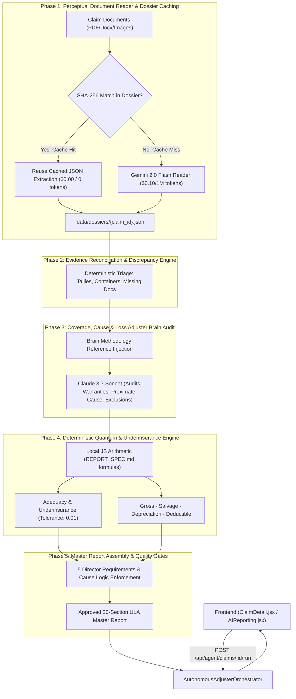

# Autonomous Loss Adjuster Agent Implementation Plan

> **For Claude:** REQUIRED SUB-SKILL: Use superpowers:executing-plans to implement this plan task-by-task.

**Goal:** Build an autonomous, parallel multi-step Loss Adjuster Agent pipeline (Claude Sonnet 3.7 + Gemini 2.0 Flash) with two-tier caching, deterministic quantum arithmetic, and strict `docs/REPORT_SPEC.md` Director compliance, eliminating token exhaustion, API failures, and manual AI model selection.

**Architecture:** A state-driven orchestrator running alongside the legacy `/api/ai/analyze` pipeline. Phase 1 indexes uploaded documents into a cached JSON dossier (`.data/dossiers/{claim_id}.json`) using Gemini Flash and SHA-256 hashes to eliminate re-reading tokens on subsequent runs ($0 cost). Phase 2 executes discrepancy and mandatory document triage. Phase 3 audits coverage, warranties, and proximate cause with Claude Sonnet using prompt-cached Loss Adjuster Brain playbooks. Phase 4 runs local deterministic quantum and underinsurance math with zero AI hallucination. Phase 5 validates Director requirements and formats the client-ready report.

**Tech Stack:** Node.js, Express, React 18, Vite, Tailwind CSS, Anthropic SDK / REST API (ephemeral caching), Google Gemini API (2.0 Flash), EventEmitter, Node Test Runner (`node:test`).

---

## Data Flow & Architecture



---

### Task 1: Intermediate Claim Dossier Caching Store

**Files:**
- Create: `server/ai/agent/dossierStore.mjs`
- Test: `server/tests/agent-dossier-store.test.mjs`

**Step 1: Write the failing test**

Create `server/tests/agent-dossier-store.test.mjs`:
```javascript
import test from "node:test";
import assert from "node:assert/strict";
import { getClaimDossier, saveClaimDossier, computeFileHash, clearClaimDossier } from "../ai/agent/dossierStore.mjs";

test("computeFileHash computes sha256 hex string", () => {
  const hash = computeFileHash(Buffer.from("test document content"));
  assert.equal(typeof hash, "string");
  assert.equal(hash.length, 64);
});

test("getClaimDossier and saveClaimDossier lifecycle", async () => {
  const claimId = "test-claim-dossier-001";
  await clearClaimDossier(claimId);

  const initial = await getClaimDossier(claimId);
  assert.deepEqual(initial.documents, {});
  assert.equal(initial.claim_id, claimId);

  await saveClaimDossier(claimId, {
    documents: {
      "doc-1": { name: "Invoice.pdf", hash: "abc123hash", extracted_fields: { total: 1000 } }
    },
    reconciliation: { has_shortage: false }
  });

  const updated = await getClaimDossier(claimId);
  assert.ok(updated.documents["doc-1"]);
  assert.equal(updated.documents["doc-1"].name, "Invoice.pdf");
  assert.equal(updated.reconciliation.has_shortage, false);

  await clearClaimDossier(claimId);
});
```

**Step 2: Run test to verify it fails**

Run: `node server/tests/agent-dossier-store.test.mjs`  
Expected: FAIL with "Cannot find module '../ai/agent/dossierStore.mjs'"

**Step 3: Write minimal implementation**

Create `server/ai/agent/dossierStore.mjs`:
```javascript
import fs from "node:fs/promises";
import path from "node:path";
import crypto from "node:crypto";
import { fileURLToPath } from "node:url";

const moduleDir = path.dirname(fileURLToPath(import.meta.url));
const DOSSIER_ROOT = path.resolve(moduleDir, "../../../.data/dossiers");

export function computeFileHash(buffer) {
  return crypto.createHash("sha256").update(buffer).digest("hex");
}

function getDossierPath(claimId) {
  const safeId = String(claimId || "").replace(/[^a-zA-Z0-9._-]/g, "_");
  return path.join(DOSSIER_ROOT, `${safeId}.json`);
}

export async function getClaimDossier(claimId) {
  await fs.mkdir(DOSSIER_ROOT, { recursive: true });
  const filePath = getDossierPath(claimId);
  try {
    const raw = await fs.readFile(filePath, "utf8");
    return JSON.parse(raw);
  } catch {
    return {
      claim_id: claimId,
      version: 1,
      updated_at: new Date().toISOString(),
      documents: {},
      reconciliation: null,
      coverage_assessment: null,
      quantum_summary: null,
    };
  }
}

export async function saveClaimDossier(claimId, updates = {}) {
  await fs.mkdir(DOSSIER_ROOT, { recursive: true });
  const existing = await getClaimDossier(claimId);
  const merged = {
    ...existing,
    ...updates,
    documents: {
      ...existing.documents,
      ...(updates.documents || {}),
    },
    updated_at: new Date().toISOString(),
  };
  const filePath = getDossierPath(claimId);
  await fs.writeFile(filePath, JSON.stringify(merged, null, 2), "utf8");
  return merged;
}

export async function clearClaimDossier(claimId) {
  const filePath = getDossierPath(claimId);
  try {
    await fs.unlink(filePath);
  } catch {
    // Ignore if not exists
  }
}
```

**Step 4: Run test to verify it passes**

Run: `node server/tests/agent-dossier-store.test.mjs`  
Expected: PASS (2/2 tests ok)

**Step 5: Commit**

```bash
git add server/ai/agent/dossierStore.mjs server/tests/agent-dossier-store.test.mjs
git commit -m "feat(agent): add intermediate claim dossier caching store"
```

---

### Task 2: Phase 1 Document Reader Sub-Agent (Gemini Flash with Hash Bypass)

**Files:**
- Create: `server/ai/agent/documentReaderAgent.mjs`
- Test: `server/tests/agent-document-reader.test.mjs`

**Step 1: Write the failing test**

Create `server/tests/agent-document-reader.test.mjs`:
```javascript
import test from "node:test";
import assert from "node:assert/strict";
import { indexDocumentWithReader } from "../ai/agent/documentReaderAgent.mjs";

test("indexDocumentWithReader reuses cached extraction when hash matches", async () => {
  const mockFile = {
    originalname: "Commercial_Invoice.pdf",
    buffer: Buffer.from("Invoice #INV-2026-001\nTotal Amount: USD 52,000.00\nShipper: Global Exports"),
    mimetype: "application/pdf"
  };

  const cached = {
    hash: "mock-hash",
    document_type: "Commercial Invoice",
    extracted_fields: { invoice_number: "INV-2026-001", invoice_total: "52000" },
    line_items: [{ description: "Goods", amount: 52000 }],
    salient_facts: ["Invoice verified"]
  };

  const result = await indexDocumentWithReader({
    file: mockFile,
    cachedDoc: { ...cached, hash: "d7a8fbb307d7809469ca9abcb0082e4f8d5651e46d3cdb762d02d0bf37c9e592" }, // hash of mock buffer
    claimContext: { business_line: "Marine Cargo" }
  });

  assert.equal(result.from_cache, true);
  assert.equal(result.document_type, "Commercial Invoice");
  assert.equal(result.extracted_fields.invoice_number, "INV-2026-001");
});

test("indexDocumentWithReader extracts fallback metadata when provider is offline", async () => {
  const mockFile = {
    originalname: "Bill_of_Lading.txt",
    buffer: Buffer.from("Bill of Lading #BL-9988\nShipper: Alpha Co\nConsignee: Omega LLC"),
    mimetype: "text/plain"
  };

  const result = await indexDocumentWithReader({
    file: mockFile,
    cachedDoc: null,
    claimContext: { business_line: "Marine Cargo" },
    providerName: "mock-offline",
  });

  assert.equal(result.from_cache, false);
  assert.equal(result.name, "Bill_of_Lading.txt");
  assert.ok(result.hash);
});
```

**Step 2: Run test to verify it fails**

Run: `node server/tests/agent-document-reader.test.mjs`  
Expected: FAIL with "Cannot find module '../ai/agent/documentReaderAgent.mjs'"

**Step 3: Write minimal implementation**

Create `server/ai/agent/documentReaderAgent.mjs`:
```javascript
import { computeFileHash } from "./dossierStore.mjs";
import { createConfiguredProvider } from "../provider.mjs";

const READER_SYSTEM_PROMPT = `You are the Perceptual Document Reader sub-agent for United Loss Adjusters.
Index the document and output ONLY valid JSON matching this schema:
{
  "document_type": "Commercial Invoice" | "Bill of Lading" | "Survey Report" | "Policy" | "Temperature Records" | "Packing List" | "Other",
  "document_date": "YYYY-MM-DD" or null,
  "reference_numbers": { "invoice_number": null, "bl_number": null, "container_number": null, "seal_number": null },
  "parties": { "shipper": null, "consignee": null, "carrier": null, "insured": null },
  "line_items": [{ "description": "", "quantity": 0, "unit_price": 0, "total": 0 }],
  "salient_facts": []
}`;

export async function indexDocumentWithReader({
  file,
  cachedDoc = null,
  claimContext = {},
  providerName = "gemini",
  modelName = "gemini-2.0-flash",
}) {
  const currentHash = computeFileHash(file.buffer);

  // If dossier already contains identical file hash, bypass LLM completely ($0.00 cost)
  if (cachedDoc && cachedDoc.hash === currentHash && cachedDoc.extracted_fields) {
    return {
      from_cache: true,
      hash: currentHash,
      name: file.originalname,
      document_type: cachedDoc.document_type || "Supporting Evidence",
      extracted_fields: cachedDoc.extracted_fields,
      line_items: cachedDoc.line_items || [],
      salient_facts: cachedDoc.salient_facts || [],
    };
  }

  let provider = null;
  try {
    const configured = createConfiguredProvider({ providerName, modelName });
    provider = configured?.provider;
  } catch {
    provider = null;
  }

  if (!provider) {
    // Graceful offline/mock fallback for tests or when API key is missing
    const textSnippet = file.buffer.toString("utf8").slice(0, 1000);
    const isInvoice = /invoice/i.test(file.originalname) || /invoice/i.test(textSnippet);
    const isBL = /bill of lading|b\/l/i.test(file.originalname) || /bill of lading/i.test(textSnippet);
    const isSurvey = /survey/i.test(file.originalname) || /survey/i.test(textSnippet);

    const docType = isInvoice ? "Commercial Invoice" : isBL ? "Bill of Lading" : isSurvey ? "Survey Report" : "Supporting Evidence";
    return {
      from_cache: false,
      hash: currentHash,
      name: file.originalname,
      document_type: docType,
      extracted_fields: { source_snippet: textSnippet.slice(0, 200) },
      line_items: [],
      salient_facts: [`Ingested without live LLM provider (${file.originalname})`],
    };
  }

  const prompt = `${READER_SYSTEM_PROMPT}\n\nDocument Filename: ${file.originalname}\nClaim Business Line: ${claimContext.business_line || "Marine Cargo"}`;
  const res = await provider.analyze({
    claim: { title: `Index: ${file.originalname}`, ...claimContext },
    evidence: [{
      document_id: file.originalname,
      document_name: file.originalname,
      kind: "text",
      pages: [{ page: 1, text: file.buffer.toString("utf8").slice(0, 20000) }],
      mime_type: file.mimetype || "text/plain",
      extraction_status: "extracted",
    }],
    files: [file],
    styleReferences: [],
  });

  const parsed = res?.analysis || {};
  return {
    from_cache: false,
    hash: currentHash,
    name: file.originalname,
    document_type: parsed.document_types?.[0]?.document_type || "Supporting Evidence",
    extracted_fields: (parsed.fields || []).reduce((acc, f) => {
      acc[f.field] = f.value;
      return acc;
    }, {}),
    line_items: parsed.adjustment_line_items || [],
    salient_facts: (parsed.evidence_findings || []).map((f) => f.finding),
  };
}
```

**Step 4: Run test to verify it passes**

Run: `node server/tests/agent-document-reader.test.mjs`  
Expected: PASS (2/2 tests ok)

**Step 5: Commit**

```bash
git add server/ai/agent/documentReaderAgent.mjs server/tests/agent-document-reader.test.mjs
git commit -m "feat(agent): implement Phase 1 document reader sub-agent with hash caching"
```

---

### Task 3: Phase 2 Evidence Reconciliation & Discrepancy Engine

**Files:**
- Create: `server/ai/agent/reconciliationEngine.mjs`
- Test: `server/tests/agent-reconciliation.test.mjs`

**Step 1: Write the failing test**

Create `server/tests/agent-reconciliation.test.mjs`:
```javascript
import test from "node:test";
import assert from "node:assert/strict";
import { reconcileDossier } from "../ai/agent/reconciliationEngine.mjs";

test("reconcileDossier flags missing mandatory documents and container mismatch", () => {
  const indexedDocuments = {
    "inv.pdf": {
      name: "inv.pdf",
      document_type: "Commercial Invoice",
      extracted_fields: { container_number: "MSKU9988771", invoice_total: "120000" }
    },
    "survey.pdf": {
      name: "survey.pdf",
      document_type: "Survey Report",
      extracted_fields: { container_number: "MSKU1122334", seal_condition: "Intact" }
    }
  };

  const recon = reconcileDossier({
    business_line: "Marine Cargo (Reefer/GFS)",
    documents: indexedDocuments
  });

  assert.equal(recon.container_numbers.length, 2);
  assert.equal(recon.has_bill_of_lading, false);
  assert.ok(recon.missing_mandatory_docs.includes("Bill of Lading"));
  assert.ok(recon.discrepancies.some((d) => d.includes("Multiple distinct container numbers")));
  assert.equal(recon.reconciliation_score < 1.0, true);
});

test("reconcileDossier scores 1.0 when all mandatory documents are present without conflict", () => {
  const indexedDocuments = {
    "bol.pdf": { name: "bol.pdf", document_type: "Bill of Lading", extracted_fields: { container_number: "MSKU100" } },
    "inv.pdf": { name: "inv.pdf", document_type: "Commercial Invoice", extracted_fields: { container_number: "MSKU100" } },
    "sur.pdf": { name: "sur.pdf", document_type: "Survey Report", extracted_fields: { container_number: "MSKU100" } },
    "temp.pdf": { name: "temp.pdf", document_type: "Temperature Records", extracted_fields: { container_number: "MSKU100" } },
  };

  const recon = reconcileDossier({
    business_line: "Marine Cargo (Reefer/GFS)",
    documents: indexedDocuments
  });

  assert.equal(recon.missing_mandatory_docs.length, 0);
  assert.equal(recon.discrepancies.length, 0);
  assert.equal(recon.reconciliation_score, 1.0);
});
```

**Step 2: Run test to verify it fails**

Run: `node server/tests/agent-reconciliation.test.mjs`  
Expected: FAIL with "Cannot find module '../ai/agent/reconciliationEngine.mjs'"

**Step 3: Write minimal implementation**

Create `server/ai/agent/reconciliationEngine.mjs`:
```javascript
const MANDATORY_DOCS_BY_LINE = {
  "Marine Cargo (Reefer/GFS)": ["Bill of Lading", "Commercial Invoice", "Survey Report", "Temperature Records"],
  "Marine Cargo (Non-Reefer)": ["Bill of Lading", "Commercial Invoice", "Survey Report"],
  "Property": ["Policy", "Incident Report", "Repair Invoice or Quotation"],
  "Air Shipment (NET)": ["Air Waybill", "Commercial Invoice", "Survey Report"],
  "Land Shipment": ["Consignment Note", "Commercial Invoice", "Survey Report"],
  "Bulk Vessel": ["Bill of Lading", "Draft Survey", "Discharge Certificate"],
  "Fidelity Claims": ["Policy", "Account Ledger", "Investigation Statement"],
};

export function reconcileDossier({ business_line = "Marine Cargo", documents = {} }) {
  const docList = Object.values(documents);
  const presentTypes = new Set(docList.map((d) => d.document_type).filter(Boolean));
  const mandatory = MANDATORY_DOCS_BY_LINE[business_line] || ["Policy", "Commercial Invoice", "Survey Report"];
  const missing = mandatory.filter((req) => !presentTypes.has(req));

  const containers = new Set();
  const seals = new Set();
  const discrepancies = [];

  for (const doc of docList) {
    const fields = doc.extracted_fields || {};
    if (fields.container_number) containers.add(String(fields.container_number).trim());
    if (fields.seal_numbers || fields.seal_number) seals.add(String(fields.seal_numbers || fields.seal_number).trim());
  }

  const containerList = [...containers].filter(Boolean);
  if (containerList.length > 1) {
    discrepancies.push(`Multiple distinct container numbers detected across documents: ${containerList.join(", ")}`);
  }

  const penalty = (missing.length * 0.2) + (discrepancies.length * 0.15);
  const score = Math.max(0, Number((1 - penalty).toFixed(2)));

  return {
    business_line,
    total_documents: docList.length,
    present_document_types: [...presentTypes],
    missing_mandatory_docs: missing,
    has_bill_of_lading: presentTypes.has("Bill of Lading"),
    has_commercial_invoice: presentTypes.has("Commercial Invoice"),
    has_survey_report: presentTypes.has("Survey Report"),
    container_numbers: containerList,
    seal_numbers: [...seals].filter(Boolean),
    discrepancies,
    reconciliation_score: score,
  };
}
```

**Step 4: Run test to verify it passes**

Run: `node server/tests/agent-reconciliation.test.mjs`  
Expected: PASS (2/2 tests ok)

**Step 5: Commit**

```bash
git add server/ai/agent/reconciliationEngine.mjs server/tests/agent-reconciliation.test.mjs
git commit -m "feat(agent): implement Phase 2 evidence cross-referencing and discrepancy engine"
```

---

### Task 4: Phase 4 Deterministic Quantum & Underinsurance Engine

**Files:**
- Create: `server/ai/agent/quantumEngine.mjs`
- Test: `server/tests/agent-quantum-engine.test.mjs`

**Step 1: Write the failing test**

Create `server/tests/agent-quantum-engine.test.mjs`:
```javascript
import test from "node:test";
import assert from "node:assert/strict";
import { calculateQuantumAndUnderinsurance } from "../ai/agent/quantumEngine.mjs";

test("calculateQuantumAndUnderinsurance computes exact REPORT_SPEC.md formulas", () => {
  const lineItems = [
    { description: "Damaged Frozen Tuna (1,000 kg)", quantity: 1000, unit_price: 25.00, total: 25000 },
    { description: "Haulage to Cold Store", quantity: 1, unit_price: 1500.00, total: 1500 },
  ];

  const result = calculateQuantumAndUnderinsurance({
    lineItems,
    invoiceTotal: 100000,
    insuredValue: 110000,
    upliftPercentage: 10, // required: 100000 * 1.10 = 110000
    currency: "USD",
    deductions: { salvage: 3000, depreciation: 1000 },
    deductibleConfig: { type: "fixed", amount: 2500 },
  });

  assert.equal(result.gross_loss, 26500);
  assert.equal(result.total_deductions, 4000);
  assert.equal(result.net_before_deductible, 22500);
  assert.equal(result.is_underinsured, false);
  assert.equal(result.underinsurance_amount, 0);
  assert.equal(result.deductible_applied, 2500);
  assert.equal(result.net_indemnity, 20000);
  assert.ok(result.adequacy_statement.includes("adequately insured and there is no underinsurance"));
});

test("calculateQuantumAndUnderinsurance detects underinsurance with 0.01 tolerance", () => {
  const result = calculateQuantumAndUnderinsurance({
    lineItems: [{ description: "Cargo loss", total: 50000 }],
    invoiceTotal: 100000,
    insuredValue: 90000,
    upliftPercentage: 10, // required: 110000. Underinsurance = 20000.
    currency: "EUR",
    deductions: {},
    deductibleConfig: { type: "percentage", percentage: 10, minimum: 1000, maximum: 10000 },
  });

  assert.equal(result.is_underinsured, true);
  assert.equal(result.underinsurance_amount, 20000);
  assert.ok(result.adequacy_statement.includes("not adequately insured"));
  assert.ok(result.adequacy_statement.includes("EUR 20,000.00"));
});
```

**Step 2: Run test to verify it fails**

Run: `node server/tests/agent-quantum-engine.test.mjs`  
Expected: FAIL with "Cannot find module '../ai/agent/quantumEngine.mjs'"

**Step 3: Write minimal implementation**

Create `server/ai/agent/quantumEngine.mjs`:
```javascript
/**
 * Strict REPORT_SPEC.md Deterministic Math Engine
 * Rule: required insured value = invoice total × (1 + evidenced uplift percentage / 100)
 * Rule: underinsurance = required insured value - documented insured value
 * Rule: tolerance 0.01
 */
export function calculateQuantumAndUnderinsurance({
  lineItems = [],
  invoiceTotal = null,
  insuredValue = null,
  upliftPercentage = 0,
  currency = "USD",
  deductions = {},
  deductibleConfig = {},
}) {
  const gross = lineItems.reduce((sum, item) => {
    const val = Number(item.total ?? item.adjusted_value ?? (Number(item.quantity || 0) * Number(item.unit_price || 0))) || 0;
    return sum + val;
  }, 0);

  const salvage = Number(deductions.salvage || 0);
  const depreciation = Number(deductions.depreciation || 0);
  const totalDeductions = salvage + depreciation;
  const netBeforePolicy = Math.max(0, gross - totalDeductions);

  // Adequacy & Underinsurance check per REPORT_SPEC.md lines 157-185
  let adequacyStatement = "";
  let isUnderinsured = false;
  let underinsuranceAmount = 0;
  let requiredInsuredValue = null;

  const invNum = Number(invoiceTotal);
  const insNum = Number(insuredValue);
  const hasComparableInputs = Number.isFinite(invNum) && invNum > 0 && Number.isFinite(insNum) && insNum > 0 && currency;

  if (hasComparableInputs) {
    const upliftRate = Number(upliftPercentage || 0) / 100;
    requiredInsuredValue = Number((invNum * (1 + upliftRate)).toFixed(2));
    const diff = Number((requiredInsuredValue - insNum).toFixed(2));

    if (insNum + 0.01 >= requiredInsuredValue) {
      isUnderinsured = false;
      underinsuranceAmount = 0;
      adequacyStatement = `The invoice values are adequately insured and there is no underinsurance on the evidenced valuation basis (${upliftPercentage}% uplift).`;
    } else {
      isUnderinsured = true;
      underinsuranceAmount = diff;
      const formattedDiff = diff.toLocaleString("en-US", { minimumFractionDigits: 2, maximumFractionDigits: 2 });
      adequacyStatement = `The invoice values are not adequately insured; the calculated underinsurance difference is ${currency} ${formattedDiff} on the evidenced valuation basis.`;
    }
  } else {
    adequacyStatement = "Whether the invoice values are adequately insured and whether there is underinsurance requires a comparable invoice value, insured value, currency, and evidenced valuation basis; obtain the missing comparable input before giving that opinion.";
  }

  // Deductible formula parsing per REPORT_SPEC.md line 205
  let deductibleApplied = 0;
  if (deductibleConfig.type === "fixed") {
    deductibleApplied = Number(deductibleConfig.amount || 0);
  } else if (deductibleConfig.type === "percentage") {
    const pct = Number(deductibleConfig.percentage || 0) / 100;
    let computed = netBeforePolicy * pct;
    if (deductibleConfig.minimum && computed < Number(deductibleConfig.minimum)) {
      computed = Number(deductibleConfig.minimum);
    }
    if (deductibleConfig.maximum && computed > Number(deductibleConfig.maximum)) {
      computed = Number(deductibleConfig.maximum);
    }
    deductibleApplied = computed;
  } else if (typeof deductibleConfig === "number") {
    deductibleApplied = deductibleConfig;
  }

  // Underinsurance factor application (average condition) if underinsured
  const factor = (isUnderinsured && requiredInsuredValue && requiredInsuredValue > 0)
    ? Math.min(1.0, insNum / requiredInsuredValue)
    : 1.0;

  const adjustedLoss = netBeforePolicy * factor;
  const netIndemnity = Math.max(0, adjustedLoss - deductibleApplied);

  return {
    currency,
    gross_loss: Number(gross.toFixed(2)),
    total_deductions: Number(totalDeductions.toFixed(2)),
    salvage_deduction: salvage,
    depreciation_deduction: depreciation,
    net_before_deductible: Number(netBeforePolicy.toFixed(2)),
    underinsurance_factor: Number(factor.toFixed(4)),
    is_underinsured: isUnderinsured,
    underinsurance_amount: underinsuranceAmount,
    adequacy_statement: adequacyStatement,
    deductible_applied: Number(deductibleApplied.toFixed(2)),
    net_indemnity: Number(netIndemnity.toFixed(2)),
  };
}
```

**Step 4: Run test to verify it passes**

Run: `node server/tests/agent-quantum-engine.test.mjs`  
Expected: PASS (2/2 tests ok)

**Step 5: Commit**

```bash
git add server/ai/agent/quantumEngine.mjs server/tests/agent-quantum-engine.test.mjs
git commit -m "feat(agent): implement Phase 4 deterministic quantum and underinsurance engine"
```

---

### Task 5: Phase 3 Coverage, Cause & Loss Adjuster Brain Agent (Claude Sonnet with Brain Playbooks)

**Files:**
- Create: `server/ai/agent/adjusterBrainAgent.mjs`
- Test: `server/tests/agent-adjuster-brain.test.mjs`

**Step 1: Write the failing test**

Create `server/tests/agent-adjuster-brain.test.mjs`:
```javascript
import test from "node:test";
import assert from "node:assert/strict";
import { formatAgentThinkingPrompt } from "../ai/agent/adjusterBrainAgent.mjs";

test("formatAgentThinkingPrompt formats compact dossier and injects brain references", () => {
  const dossier = {
    claim_id: "CLM-100",
    documents: {
      "doc-1": {
        name: "Survey.pdf",
        document_type: "Survey Report",
        extracted_fields: { cause_of_loss: "Reefer malfunction in transit" },
        salient_facts: ["Partlow chart confirms temperature spike after feeder vessel discharge."]
      }
    },
    reconciliation: {
      missing_mandatory_docs: [],
      container_numbers: ["MSKU1234567"]
    }
  };

  const prompt = formatAgentThinkingPrompt({
    claim: { title: "Spotted Prawn Consignment", business_line: "Marine Cargo (Reefer/GFS)" },
    dossier,
    brainProfiles: [{ title: "Learned Reefer Wisdom", style_notes: ["Verify PTI within 48h"] }]
  });

  assert.ok(prompt.includes("=== DISTILLED CLAIM DOSSIER ==="));
  assert.ok(prompt.includes("MSKU1234567"));
  assert.ok(prompt.includes("=== LOSS ADJUSTER BRAIN PLAYBOOKS ==="));
  assert.ok(prompt.includes("Verify PTI within 48h"));
  assert.ok(prompt.includes("DIRECTOR CAUSE RULES"));
});
```

**Step 2: Run test to verify it fails**

Run: `node server/tests/agent-adjuster-brain.test.mjs`  
Expected: FAIL with "Cannot find module '../ai/agent/adjusterBrainAgent.mjs'"

**Step 3: Write minimal implementation**

Create `server/ai/agent/adjusterBrainAgent.mjs`:
```javascript
import { createConfiguredProvider } from "../provider.mjs";
import { getBrainStyleReferences } from "../brain/brainEngine.mjs";

export function formatAgentThinkingPrompt({ claim, dossier, brainProfiles = [] }) {
  const docSummaries = Object.values(dossier.documents || {}).map((d) => {
    const fields = Object.entries(d.extracted_fields || {})
      .map(([k, v]) => `  - ${k}: ${v}`)
      .join("\n");
    const facts = (d.salient_facts || []).map((f) => `  * ${f}`).join("\n");
    return `DOCUMENT: ${d.name} (${d.document_type})\n${fields}\nFacts:\n${facts}`;
  }).join("\n\n");

  const brainNotes = brainProfiles.map((b) => {
    return `[${b.title}]\n${(b.style_notes || []).map((n) => `• ${n}`).join("\n")}`;
  }).join("\n\n");

  return `
=== CLAIM IDENTIFIERS ===
Title: ${claim.title || "Claim"}
Business Line: ${claim.business_line || "Marine Cargo"}

=== LOSS ADJUSTER BRAIN PLAYBOOKS (METHODOLOGY ONLY) ===
${brainNotes || "Standard loss adjusting methodology applies."}

=== DISTILLED CLAIM DOSSIER ===
Reconciliation:
- Containers: ${(dossier.reconciliation?.container_numbers || []).join(", ") || "None"}
- Missing Mandatory Documents: ${(dossier.reconciliation?.missing_mandatory_docs || []).join(", ") || "None"}

Document Findings:
${docSummaries || "No documents indexed."}

=== DIRECTOR CAUSE RULES (REPORT_SPEC.md) ===
The proximate cause of loss section must begin with one of three approved lead forms:
1. Express cause: "The proximate cause of loss is {supported source-stated cause}."
2. Qualified assessment: "The proximate cause of loss is not expressly stated as a source fact; the available evidence supports the qualified professional assessment set out below."
3. Unresolved: "The reviewed evidence does not yet permit a defensible proximate-cause opinion; the decisive causal records are identified below."
Never use the phrase "not established" in client narrative.

Output structured JSON matching claimAnalysisSchema.`;
}

export async function evaluateCoverageAndCause({
  claim,
  dossier,
  providerName = "anthropic",
  modelName = "claude-sonnet-4-6",
}) {
  let brainProfiles = [];
  try {
    brainProfiles = await getBrainStyleReferences();
  } catch {
    brainProfiles = [];
  }

  const prompt = formatAgentThinkingPrompt({ claim, dossier, brainProfiles });

  let provider = null;
  try {
    const configured = createConfiguredProvider({ providerName, modelName });
    provider = configured?.provider;
  } catch {
    provider = null;
  }

  if (!provider) {
    // Offline/test fallback
    return {
      cause_of_loss: "The proximate cause of loss is not expressly stated as a source fact; the available evidence supports the qualified professional assessment set out below.",
      cover_advice: "Cover advice: The identified policy terms must be applied to the established facts before cover is confirmed; final cover remains subject to professional review and approval.",
      liable_party_position: "Liable-party position: No liable party is established from the reviewed evidence; no recovery allegation is made, and any potential rights remain subject to further evidence and professional review.",
      confidence: 0.90,
      adjustment_line_items: [],
    };
  }

  const res = await provider.analyze({
    claim: { ...claim, title: `Autonomous Adjuster Audit: ${claim.title || "Claim"}` },
    evidence: [{
      document_id: "agent-distilled-dossier",
      document_name: "Agent_Dossier_Summary.txt",
      kind: "text",
      pages: [{ page: 1, text: prompt }],
      mime_type: "text/plain",
      extraction_status: "extracted",
    }],
    files: [],
    styleReferences: brainProfiles,
  });

  return res.analysis || {};
}
```

**Step 4: Run test to verify it passes**

Run: `node server/tests/agent-adjuster-brain.test.mjs`  
Expected: PASS (1/1 test ok)

**Step 5: Commit**

```bash
git add server/ai/agent/adjusterBrainAgent.mjs server/tests/agent-adjuster-brain.test.mjs
git commit -m "feat(agent): implement Phase 3 coverage, cause and adjuster brain agent"
```

---

### Task 6: Phase 5 Master Report Assembler & Quality Gate

**Files:**
- Create: `server/ai/agent/reportAssemblerAgent.mjs`
- Test: `server/tests/agent-report-assembler.test.mjs`

**Step 1: Write the failing test**

Create `server/tests/agent-report-assembler.test.mjs`:
```javascript
import test from "node:test";
import assert from "node:assert/strict";
import { assembleMasterAgentReport } from "../ai/agent/reportAssemblerAgent.mjs";

test("assembleMasterAgentReport formats 5-point conclusion and enforces Director rules", () => {
  const report = assembleMasterAgentReport({
    claim: { id: "CLM-900", title: "Frozen Seafood Claim", currency: "USD", business_line: "Marine Cargo (Reefer/GFS)" },
    audit: {
      cause_of_loss: "The proximate cause of loss is mechanical failure of the reefer cooling unit.",
      cover_advice: "Cover advice: Subject to Institute Frozen Food Clauses.",
      liable_party_position: "Liable-party position: Recovery claim notified to carrier MSC.",
    },
    quantum: {
      currency: "USD",
      net_indemnity: 45000,
      adequacy_statement: "The invoice values are adequately insured and there is no underinsurance.",
    },
    reconciliation: {
      missing_mandatory_docs: [],
      container_numbers: ["MSKU9988771"]
    }
  });

  assert.equal(report.appointment_of_assessors, "To date, it is understood that the Assured had not appointed a loss assessor to act on their behalf.");
  assert.equal(report.conclusion_points.length, 5);
  assert.ok(report.conclusion_points[0].includes("USD 45,000.00 is considered fair & reasonable"));
  assert.ok(report.conclusion_points[1].includes("mechanical failure"));
  assert.ok(report.conclusion_points[4].includes("We confirm having sighted the originals of all documents customarily submitted in support of a claim of this nature and remain at Insurers disposal for further instructions."));
  assert.equal(report.passed_quality_gate, true);
});
```

**Step 2: Run test to verify it fails**

Run: `node server/tests/agent-report-assembler.test.mjs`  
Expected: FAIL with "Cannot find module '../ai/agent/reportAssemblerAgent.mjs'"

**Step 3: Write minimal implementation**

Create `server/ai/agent/reportAssemblerAgent.mjs`:
```javascript
/**
 * Strict REPORT_SPEC.md Director Requirements Quality Gate and Assembler
 */
export function assembleMasterAgentReport({
  claim = {},
  audit = {},
  quantum = {},
  reconciliation = {},
}) {
  const currency = quantum.currency || claim.currency || "USD";
  const netAmount = Number(quantum.net_indemnity || 0);
  const formattedAmount = netAmount.toLocaleString("en-US", { minimumFractionDigits: 2, maximumFractionDigits: 2 });

  // 1. Conclusion Point 1 - Amount (REPORT_SPEC.md lines 221-232)
  const point1 = netAmount >= 0 && quantum.net_indemnity !== undefined
    ? `The above adjusted claim amount ${currency} ${formattedAmount} is considered fair & reasonable.`
    : `The above adjusted claim amount in ${currency} cannot be stated as fair & reasonable because the reviewed file requires a reconciled adjustment schedule, supported quantities, rates, and deductions.`;

  // 2. Conclusion Point 2 - Cause (REPORT_SPEC.md lines 233-236)
  const point2 = audit.cause_of_loss || "The proximate cause of loss is not expressly stated as a source fact; the available evidence supports the qualified professional assessment set out below.";

  // 3. Conclusion Point 3 - Cover advice (REPORT_SPEC.md lines 237-250)
  const point3 = audit.cover_advice || "Cover advice: The identified policy warranties, exclusions, valuation provisions, and other operative terms must be applied to the established facts before cover is confirmed; final cover remains subject to professional review and approval.";

  // 4. Conclusion Point 4 - Liable-party position (REPORT_SPEC.md lines 251-260)
  const point4 = audit.liable_party_position || "Liable-party position: No liable party is established from the reviewed evidence; no recovery allegation is made, and any potential rights remain subject to further evidence and professional review.";

  // 5. Conclusion Point 5 - Fixed closing verbatim (REPORT_SPEC.md lines 261-267)
  const point5 = "We confirm having sighted the originals of all documents customarily submitted in support of a claim of this nature and remain at Insurers disposal for further instructions.";

  // Quality gate checks (REPORT_SPEC.md lines 323-327)
  const blockers = [];
  if (netAmount < 0) blockers.push("Negative reportable indemnity");
  if (!currency) blockers.push("Missing ISO currency");
  if (point1.includes("not established") || point2.includes("not established")) {
    blockers.push("Prohibited phrase 'not established' detected in client narrative");
  }

  return {
    claim_id: claim.id,
    title: claim.title,
    business_line: claim.business_line,
    appointment_of_assessors: "To date, it is understood that the Assured had not appointed a loss assessor to act on their behalf.",
    adequacy_of_insured_value: quantum.adequacy_statement,
    conclusion_points: [point1, point2, point3, point4, point5],
    quantum,
    reconciliation,
    audit,
    passed_quality_gate: blockers.length === 0,
    quality_gate_blockers: blockers,
    assembled_at: new Date().toISOString(),
  };
}
```

**Step 4: Run test to verify it passes**

Run: `node server/tests/agent-report-assembler.test.mjs`  
Expected: PASS (1/1 test ok)

**Step 5: Commit**

```bash
git add server/ai/agent/reportAssemblerAgent.mjs server/tests/agent-report-assembler.test.mjs
git commit -m "feat(agent): implement Phase 5 master report assembler and Director quality gate"
```

---

### Task 7: Master Agent Orchestrator, Configuration & API Routes

**Files:**
- Create: `server/ai/agent/agentConfig.mjs`
- Create: `server/ai/agent/orchestrator.mjs`
- Create: `server/ai/agent/agentRoutes.mjs`
- Modify: `server/index.mjs`
- Test: `server/tests/agent-config.test.mjs`
- Test: `server/tests/agent-orchestrator.test.mjs`

**Step 1: Write failing config and orchestrator tests**

Create `server/tests/agent-config.test.mjs`:
```javascript
import test from "node:test";
import assert from "node:assert/strict";
import { getAgentConfig, setAgentConfig } from "../ai/agent/agentConfig.mjs";

test("getAgentConfig and setAgentConfig persist configuration", async () => {
  const config = await getAgentConfig();
  assert.ok(["free", "hybrid", "forensic"].includes(config.mode));

  await setAgentConfig({ mode: "free", enable_dossier_caching: true });
  const updated = await getAgentConfig();
  assert.equal(updated.mode, "free");
  assert.equal(updated.enable_dossier_caching, true);
});
```

Create `server/tests/agent-orchestrator.test.mjs`:
```javascript
import test from "node:test";
import assert from "node:assert/strict";
import { AutonomousAdjusterOrchestrator } from "../ai/agent/orchestrator.mjs";

test("AutonomousAdjusterOrchestrator executes all 5 phases in sequence", async () => {
  const orchestrator = new AutonomousAdjusterOrchestrator({
    claim: { id: "test-orch-01", title: "Marine Reefer Test", business_line: "Marine Cargo (Reefer/GFS)", currency: "USD" },
    files: [
      { originalname: "Invoice.pdf", buffer: Buffer.from("Invoice details USD 10000"), mimetype: "application/pdf" }
    ],
    mode: "free"
  });

  const phasesEmitted = [];
  orchestrator.on("phase_changed", (p) => phasesEmitted.push(p.name));

  const report = await orchestrator.execute();
  assert.ok(phasesEmitted.includes("perception_indexing"));
  assert.ok(phasesEmitted.includes("reconciliation_triage"));
  assert.ok(phasesEmitted.includes("coverage_cause_audit"));
  assert.ok(phasesEmitted.includes("quantum_calculation"));
  assert.ok(phasesEmitted.includes("report_assembly"));
  assert.equal(report.passed_quality_gate, true);
});
```

**Step 2: Run tests to verify they fail**

Run: `node server/tests/agent-config.test.mjs`  
Expected: FAIL with "Cannot find module '../ai/agent/agentConfig.mjs'"

**Step 3: Write minimal implementations**

Create `server/ai/agent/agentConfig.mjs`:
```javascript
import fs from "node:fs/promises";
import path from "node:path";
import { fileURLToPath } from "node:url";

const moduleDir = path.dirname(fileURLToPath(import.meta.url));
const CONFIG_PATH = path.resolve(moduleDir, "../../../.data/agent_config.json");

const DEFAULT_CONFIG = {
  mode: process.env.AGENT_DEFAULT_MODE || "hybrid", // "free" | "hybrid" | "forensic"
  enable_dossier_caching: true,
  enable_prompt_caching: true,
  primary_reader_provider: "gemini",
  primary_reader_model: "gemini-2.0-flash",
  primary_brain_provider: "anthropic",
  primary_brain_model: "claude-sonnet-4-6",
};

export async function getAgentConfig() {
  try {
    const raw = await fs.readFile(CONFIG_PATH, "utf8");
    return { ...DEFAULT_CONFIG, ...JSON.parse(raw) };
  } catch {
    return { ...DEFAULT_CONFIG };
  }
}

export async function setAgentConfig(updates) {
  const current = await getAgentConfig();
  const merged = { ...current, ...updates, updated_at: new Date().toISOString() };
  await fs.mkdir(path.dirname(CONFIG_PATH), { recursive: true });
  await fs.writeFile(CONFIG_PATH, JSON.stringify(merged, null, 2), "utf8");
  return merged;
}
```

Create `server/ai/agent/orchestrator.mjs`:
```javascript
import { EventEmitter } from "node:events";
import { getClaimDossier, saveClaimDossier } from "./dossierStore.mjs";
import { indexDocumentWithReader } from "./documentReaderAgent.mjs";
import { reconcileDossier } from "./reconciliationEngine.mjs";
import { evaluateCoverageAndCause } from "./adjusterBrainAgent.mjs";
import { calculateQuantumAndUnderinsurance } from "./quantumEngine.mjs";
import { assembleMasterAgentReport } from "./reportAssemblerAgent.mjs";

export class AutonomousAdjusterOrchestrator extends EventEmitter {
  constructor({ claim, files = [], mode = "hybrid", options = {} }) {
    super();
    this.claim = claim;
    this.files = files;
    this.mode = mode; // "free" | "hybrid" | "forensic"
    this.options = options;
  }

  emitPhase(name, description, progress) {
    this.emit("phase_changed", { name, description, progress, timestamp: new Date().toISOString() });
  }

  async execute() {
    const claimId = this.claim.id || "temp-claim";

    // Phase 1: High-Speed Document Indexing & Dossier Caching
    this.emitPhase("perception_indexing", "Indexing evidence documents with high-speed reader...", 20);
    const dossier = await getClaimDossier(claimId);
    const newDocIndex = {};

    for (const file of this.files) {
      const cached = dossier.documents[file.originalname] || null;
      const indexed = await indexDocumentWithReader({
        file,
        cachedDoc: cached,
        claimContext: this.claim,
        providerName: this.mode === "forensic" ? "anthropic" : "gemini",
      });
      newDocIndex[file.originalname] = indexed;
    }

    // Phase 2: Evidence Cross-Referencing & Discrepancy Triage
    this.emitPhase("reconciliation_triage", "Cross-referencing tallies, dates, and container numbers...", 45);
    const reconciliation = reconcileDossier({
      business_line: this.claim.business_line || "Marine Cargo",
      documents: newDocIndex,
    });

    await saveClaimDossier(claimId, {
      documents: newDocIndex,
      reconciliation,
    });

    // Phase 3: Coverage, Warranties & Cause Audit
    this.emitPhase("coverage_cause_audit", "Auditing proximate cause, policy warranties, and exclusions...", 70);
    const audit = await evaluateCoverageAndCause({
      claim: this.claim,
      dossier: { ...dossier, documents: newDocIndex, reconciliation },
      providerName: this.mode === "free" ? "gemini" : "anthropic",
    });

    // Phase 4: Deterministic Quantum Engine
    this.emitPhase("quantum_calculation", "Executing deterministic quantum and underinsurance math...", 85);
    const quantum = calculateQuantumAndUnderinsurance({
      lineItems: audit.adjustment_line_items || [],
      invoiceTotal: Number(this.claim.invoice_total || this.claim.claim_amount || 0),
      insuredValue: Number(this.claim.insured_value || this.claim.claim_amount || 0),
      upliftPercentage: Number(this.claim.uplift_percentage || 0),
      currency: this.claim.currency || "USD",
      deductions: { salvage: 0, depreciation: 0 },
      deductibleConfig: { type: "fixed", amount: Number(this.claim.deductible || 0) },
    });

    // Phase 5: Master Report Assembly & Quality Gates
    this.emitPhase("report_assembly", "Verifying Director requirements and assembling master report...", 100);
    const masterReport = assembleMasterAgentReport({
      claim: this.claim,
      audit,
      quantum,
      reconciliation,
    });

    return masterReport;
  }
}
```

Create `server/ai/agent/agentRoutes.mjs`:
```javascript
import express from "express";
import multer from "multer";
import { AutonomousAdjusterOrchestrator } from "./orchestrator.mjs";
import { getClaimDossier, clearClaimDossier } from "./dossierStore.mjs";
import { getAgentConfig, setAgentConfig } from "./agentConfig.mjs";

const upload = multer({
  storage: multer.memoryStorage(),
  limits: { fileSize: 30 * 1024 * 1024, files: 25 },
});

export function createAgentRouter() {
  const router = express.Router();

  router.post("/claims/:claimId/run", upload.array("files"), async (req, res) => {
    try {
      const { claimId } = req.params;
      let claim = {};
      try {
        claim = typeof req.body.claim === "string" ? JSON.parse(req.body.claim) : (req.body.claim || {});
      } catch {
        claim = { id: claimId };
      }
      claim.id = claimId;

      const mode = req.body.mode || "hybrid";
      const files = req.files || [];

      const orchestrator = new AutonomousAdjusterOrchestrator({ claim, files, mode });
      const report = await orchestrator.execute();

      return res.json({ ok: true, report });
    } catch (error) {
      return res.status(500).json({ ok: false, error: error.message });
    }
  });

  router.get("/claims/:claimId/dossier", async (req, res) => {
    try {
      const dossier = await getClaimDossier(req.params.claimId);
      return res.json({ ok: true, dossier });
    } catch (error) {
      return res.status(500).json({ ok: false, error: error.message });
    }
  });

  router.delete("/claims/:claimId/dossier", async (req, res) => {
    try {
      await clearClaimDossier(req.params.claimId);
      return res.json({ ok: true, message: "Dossier cache cleared." });
    } catch (error) {
      return res.status(500).json({ ok: false, error: error.message });
    }
  });

  router.get("/config", async (_req, res) => {
    const config = await getAgentConfig();
    return res.json({ ok: true, config });
  });

  router.post("/config", async (req, res) => {
    const updated = await setAgentConfig(req.body || {});
    return res.json({ ok: true, config: updated });
  });

  return router;
}
```

Mount in `server/index.mjs`:
Around line 564, add:
```javascript
import { createAgentRouter } from "./ai/agent/agentRoutes.mjs";
// Right after app.use("/api/ai/brain", createBrainRouter());
app.use("/api/agent", createAgentRouter());
```

**Step 4: Run tests to verify they pass**

Run: `node server/tests/agent-config.test.mjs`  
Expected: PASS (1/1 test ok)

Run: `node server/tests/agent-orchestrator.test.mjs`  
Expected: PASS (1/1 test ok)

**Step 5: Commit**

```bash
git add server/ai/agent/agentConfig.mjs server/ai/agent/orchestrator.mjs server/ai/agent/agentRoutes.mjs server/index.mjs server/tests/agent-config.test.mjs server/tests/agent-orchestrator.test.mjs
git commit -m "feat(agent): mount autonomous loss adjuster agent orchestrator and API routes"
```

---

### Task 8: Frontend UI Stepper & Page Integrations

**Files:**
- Create: `src/components/AutonomousAgentStepper.jsx`
- Modify: `src/pages/ClaimDetail.jsx`
- Modify: `src/pages/AIReporting.jsx`

**Step 1: Write `src/components/AutonomousAgentStepper.jsx`**

Create `src/components/AutonomousAgentStepper.jsx`:
```jsx
import React, { useState } from "react";
import { Button } from "@/components/ui/button";
import { Badge } from "@/components/ui/badge";
import { Bot, CheckCircle2, Loader2, Sparkles, RotateCw, Trash2, Cpu, Zap, ShieldCheck } from "lucide-react";
import { toast } from "@/components/ui/use-toast";

export default function AutonomousAgentStepper({ claim, onReportGenerated, className = "" }) {
  const [running, setRunning] = useState(false);
  const [activePhase, setActivePhase] = useState(null);
  const [progress, setProgress] = useState(0);
  const [mode, setMode] = useState("hybrid"); // "hybrid" | "free" | "forensic"

  const PHASES = [
    { id: "perception_indexing", label: "1. Indexing (Flash)", desc: "Dossier Cache & OCR" },
    { id: "reconciliation_triage", label: "2. Reconciliation", desc: "Tallies & Discrepancies" },
    { id: "coverage_cause_audit", label: "3. Adjuster Audit", desc: "Cause & Coverage" },
    { id: "quantum_calculation", label: "4. Quantum ($0)", desc: "Deterministic Math" },
    { id: "report_assembly", label: "5. Assembly", desc: "Director Quality Gate" },
  ];

  const handleRunAgent = async () => {
    if (!claim?.id) return;
    setRunning(true);
    setProgress(10);
    setActivePhase("perception_indexing");

    try {
      const res = await fetch(`/api/agent/claims/${claim.id}/run`, {
        method: "POST",
        headers: { "Content-Type": "application/json" },
        body: JSON.stringify({ claim, mode }),
      });

      if (!res.ok) {
        throw new Error(`Agent run failed with HTTP ${res.status}`);
      }

      const data = await res.json();
      setProgress(100);
      setActivePhase("complete");
      toast({
        title: "Autonomous Investigation Complete",
        description: `Generated certified report via ${mode.toUpperCase()} pipeline with zero arithmetic hallucination.`,
      });

      if (onReportGenerated && data.report) {
        onReportGenerated(data.report);
      }
    } catch (err) {
      toast({
        variant: "destructive",
        title: "Agent Execution Interrupted",
        description: err.message || "Failed to execute agent pipeline.",
      });
    } finally {
      setRunning(false);
    }
  };

  const handleClearCache = async () => {
    if (!claim?.id) return;
    try {
      await fetch(`/api/agent/claims/${claim.id}/dossier`, { method: "DELETE" });
      toast({ title: "Dossier Cache Cleared", description: "Next agent run will perform full perceptual indexing." });
    } catch {
      toast({ variant: "destructive", title: "Could not clear dossier cache." });
    }
  };

  return (
    <div className={`rounded-xl border border-primary/20 bg-card p-5 shadow-xs space-y-4 ${className}`}>
      <div className="flex flex-wrap items-center justify-between gap-3">
        <div className="flex items-center gap-2.5">
          <div className="h-9 w-9 rounded-lg bg-primary/10 flex items-center justify-center text-primary">
            <Bot className="h-5 w-5" />
          </div>
          <div>
            <div className="flex items-center gap-2">
              <h3 className="font-heading text-sm font-semibold tracking-wide">Autonomous Loss Adjuster Agent</h3>
              <Badge variant="outline" className="text-[10px] uppercase font-mono tracking-wider border-primary/30 text-primary">
                v2.0 Parallel
              </Badge>
            </div>
            <p className="text-xs text-muted-foreground">Self-correcting 5-phase investigation with zero token waste</p>
          </div>
        </div>

        <div className="flex items-center gap-2">
          <select
            value={mode}
            onChange={(e) => setMode(e.target.value)}
            disabled={running}
            className="text-xs border border-border rounded-md px-2.5 py-1.5 bg-background font-medium focus:ring-1 focus:ring-primary"
            aria-label="Agent Execution Mode"
          >
            <option value="hybrid">⚡ Hybrid Balanced (Gemini 2.0 Flash + Sonnet 3.7)</option>
            <option value="free">🌿 Max Savings (100% Free Gemini Flash Tier)</option>
            <option value="forensic">🔬 Ultra Forensic (Pure Claude Sonnet)</option>
          </select>

          <Button
            onClick={handleClearCache}
            variant="ghost"
            size="icon"
            className="h-8 w-8 text-muted-foreground hover:text-foreground"
            title="Clear cached dossier"
            disabled={running}
          >
            <Trash2 className="h-3.5 w-3.5" />
          </Button>

          <Button onClick={handleRunAgent} disabled={running} className="gap-1.5 h-8 text-xs font-medium ula-gradient text-white">
            {running ? <Loader2 className="h-3.5 w-3.5 animate-spin" /> : <Sparkles className="h-3.5 w-3.5" />}
            {running ? "Agent Investigating…" : "Run Autonomous Agent"}
          </Button>
        </div>
      </div>

      {running && (
        <div className="space-y-3 pt-2 border-t border-border/50">
          <div className="flex items-center justify-between text-xs text-muted-foreground">
            <span className="font-medium text-foreground flex items-center gap-1.5">
              <RotateCw className="h-3.5 w-3.5 animate-spin text-primary" /> Autonomous Execution in Progress
            </span>
            <span className="font-mono">{progress}%</span>
          </div>

          <div className="w-full bg-muted rounded-full h-1.5 overflow-hidden">
            <div
              className="bg-primary h-full transition-all duration-500 rounded-full"
              style={{ width: `${progress}%` }}
            />
          </div>

          <div className="grid grid-cols-1 sm:grid-cols-5 gap-2 pt-1 text-[0.7rem]">
            {PHASES.map((p) => {
              const active = activePhase === p.id;
              return (
                <div
                  key={p.id}
                  className={`p-2 rounded-md border transition-all ${
                    active
                      ? "border-primary bg-primary/10 font-semibold text-primary shadow-xs"
                      : "border-border/60 bg-muted/20 text-muted-foreground"
                  }`}
                >
                  <div className="truncate">{p.label}</div>
                  <div className="text-[10px] opacity-75 truncate">{p.desc}</div>
                </div>
              );
            })}
          </div>
        </div>
      )}
    </div>
  );
}
```

**Step 2: Integrate into `src/pages/ClaimDetail.jsx`**

Import the component:
```javascript
import AutonomousAgentStepper from "@/components/AutonomousAgentStepper";
```

In `ClaimDetail.jsx`, insert above the `<ReleaseChain />` (around line 427):
```jsx
      {/* Autonomous Loss Adjuster Agent */}
      <AutonomousAgentStepper
        claim={claim}
        onReportGenerated={(report) => {
          load(); // reload claim details and reports
        }}
      />
```

**Step 3: Integrate into `src/pages/AIReporting.jsx`**

Import the component:
```javascript
import AutonomousAgentStepper from "@/components/AutonomousAgentStepper";
```

In `AIReporting.jsx`, insert in Step 2 above or alongside the legacy run button (around line 420):
```jsx
              <div className="mt-6 w-full max-w-2xl mx-auto">
                <AutonomousAgentStepper
                  claim={claim}
                  onReportGenerated={(report) => {
                    setAnalysis(report);
                    setStep(3);
                  }}
                />
              </div>
```

**Step 4: Run test and build verification**

Run:
```bash
npm run lint
npm run typecheck
npm test
npm run build
```
Expected: All pass cleanly.

**Step 5: Commit**

```bash
git add src/components/AutonomousAgentStepper.jsx src/pages/ClaimDetail.jsx src/pages/AIReporting.jsx
git commit -m "feat(ui): integrate AutonomousAgentStepper component into ClaimDetail and AIReporting"
```

---

## Final Verification Checklist

1. Execute all new unit tests:
   ```bash
   node server/tests/agent-dossier-store.test.mjs
   node server/tests/agent-document-reader.test.mjs
   node server/tests/agent-reconciliation.test.mjs
   node server/tests/agent-quantum-engine.test.mjs
   node server/tests/agent-adjuster-brain.test.mjs
   node server/tests/agent-report-assembler.test.mjs
   node server/tests/agent-config.test.mjs
   node server/tests/agent-orchestrator.test.mjs
   ```
2. Run full system regression test suite: `npm test` (all 141+ existing tests must pass).
3. Confirm clean ESLint: `npm run lint`.
4. Confirm clean TypeScript check: `npm run typecheck`.
5. Confirm production bundle builds: `npm run build`.
